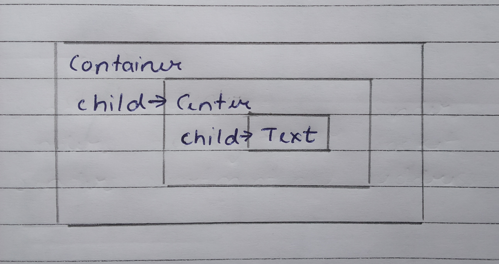
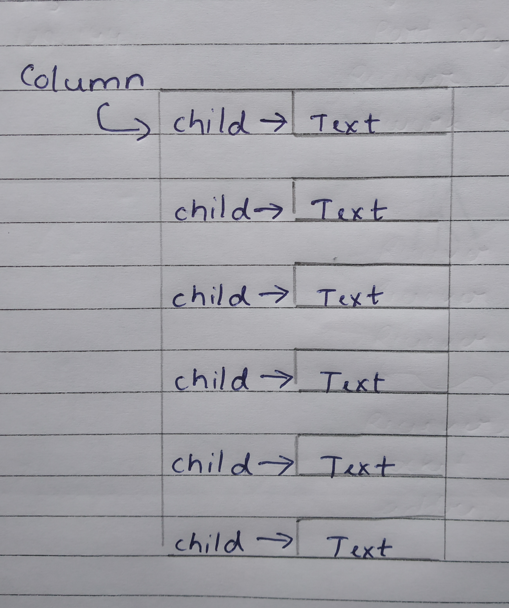

# Flutter

Flutter is Google's UI toolkit for building beautiful, natively compiled applications for mobile, web, desktop, and embedded devices from a single codebase.

Some advantages of using Flutter are :-
* Mordern and reactive framework
* Uses dart which is easy to learn
* Fast development
* Same UI can run over multiple application
* Fluid and asthetic interfaces

# Widgets

Just like how Almost everything is JS is an object, In flutter everything is widget.Inface the application itself can be considered as Widget. Widget are basically user interface components used to create interface.

Most Important widgets used in creating any app :-
* MyApp - User created Widget/Root of the application
* MaterialApp - home property to specify user interface
* Scaffold - has two properties - body and appbar

## Types of Widget

There are two types of Widget in flutter :-
* Stateless Widget
* Stateful Widget

Understanding these widget type is very important as it also helps us understand how flutter does the sate-management of the application.

### Stateless Widgets

Stateless widgets are widgets that do not change or will not change in the future. They only run once when the app is created. Basically, something like a Text field that will not change over time.

### Stateful Widgets

Stateful widgets are widget that can change over time. It is a dynamic in nature. These widget hold the state i.e information. When the state of the widget changes the UI is rebuilt again, something like checkbox which can have two states, checked and unchecked.

# Flutter Layout

Not going into too much detail. flutter layout widgets can be grouped into two types based on its child :-
* Widget with single child
* Widget with multiple child

## Single Child

Single child Widget can be often deceiving. At first encounter, we often think of them as a widget that hold only one entity, which is true. However, we can form chain of single child to make use of multiple single child Widget.

Single child Widget includes :-
* Container
* Text
* Center
* Padding
* Align

## Multi Child

As the name suggets multi-child widgets can hold multiple widgets into them. We often refer to it as childrens.

Multi-Child Widgets include :-
* Row
* Column
* Expanded
* ListView
* Stack

# Other Features

Not draggin this too much, Flutter provides devlopers with many other features that help us create precise and fluid UI.

Some of features are :-
* Gestures
* Animations
* Accessing Rest API
* Quick Navigation & Routing
* Splash Screens
* Drawers
* Toasts
* Snackbar
* Progress bar

Also, Along with these features, we can also add third party packages that can come with their own distinct features.

