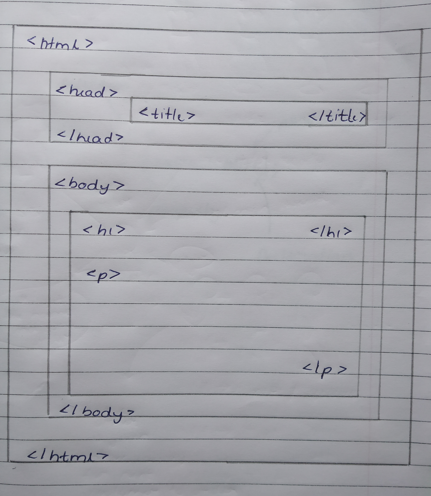
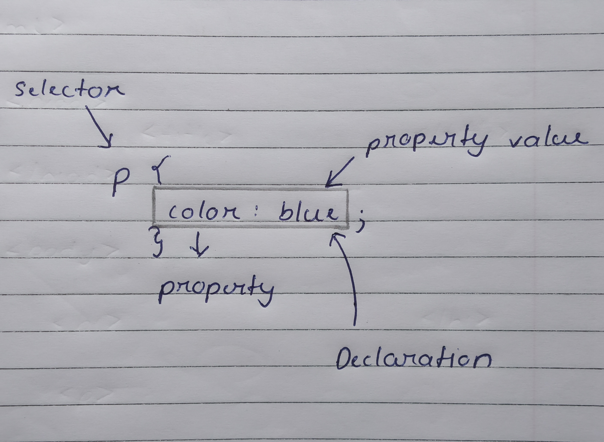

# <span class="header">HTML</span>

HTML is a language in which most website are written in. HTMl is used to create pages. HTML focuses on the structure of the page rather then its appearance.

Tags and Attributes

HTML are based on tags and attributes.
Tags are used to markup the start of an HTML element whereas attributes contain additional pieces information

Eg :- ``

## <span class="header2">Basic Structure of an HTML Page</span>



* \<html> - signals the start of html code
* \<head> - Metadata for the pages. Also includes \<title> - Place to insert page name.
* \<body> - Content of pages

## <span class="header2">Links</span>

Everything on internet has link. Each link can takes us to a different page from the website or to an external site.

To include a link we need to make use of the \<a> tag, which is called as Anchor tag.

The format of Anchor tag is as follows :-
`\<a href="https://Something.com">Text\</a>

The href part points to the page and the second part is the text which will be displayed to the viewer which when click will redirect to the target site.

## <span class="header2">Table</span>

Tables are one of the best ways to keep data neat and orderly.

To create a table we use the \<table> tag.
We also need to know a few more tags like :-
* td - table data
* tr - table row
* th - table header
* tf - table foot

Eg :-
```h
<table>
<tr>
<td>1</td>
<td>2</td>
<td>3</td>
</tr>
</table>

// will create 1 row and 3 cells
```

## <span class="header2">Other key elements</span>

|Element | Meaning |
| -- | -- |
| \<b> | Bold |
| \<strong> | Strong |
| \<i> | Italic |
| \<em> | Emphasized Text |
| \<mark> | Marked Text |
| \<strike> | Strike out Text |
| \<sub> | subscript Text |
| \<sup> | superscript Text |

# <span class="header">CSS</span>

CSS is not a programming language. CSS is a style sheet language. CSS is a HTML tool to provide easy control over layout and presentation of websites.

## <span class="header2">Why CSS is needed ?</span>

As humans we are visual creatures. We understand information quicker when its visual and better when its organized in a layout. Since HTML is plain in nature, without HTML website wont be as appealing as with CSS.

CSS allows use to :-
* Specify fonts other than the default for the browser
* Specify color and size of text and links
* Apply colors to backgrounds
* Contain webpage elements in boxes and float those boxes to specific positions on the page
  
## <span class="header2">Understanding CSS code</span>

Below is the structure of CSS code. It is called the rule or rule-set for css.



Selector - defines the element to be styled

Declaration - specifies which of the elements properties we want to style

Properties - Ways in which we can style css

Property Value - Appearance for a given property

### <span class="header3">Types of Selectors</span>

| Selector Name | What it selects | Example |
| -- | -- | -- |
| tag | All HTML elements of specified type | \<p>|
| id | Element on the page with specified id | \<p id="1"> |
| class | Element on the page with specified class | \<p class="a"> |
| attribute | Element on the page with specified attribute | img[src] |
| Pseudo-class | Specified element but only specified state | a:hover |

## <span class="header2">Box Model</span>

CSS layout is mostly based on box model. Each box on the page has properties like :
* border : space around content
* margin : solid line outside padding
* padding : space around the outside border. 

CSS also provides us properties like :-
* width
* background-color
* color
* text-shadow
* display


<style>
.highlight{
  color: #75FF33
}
.header3{
  color: #E6D100
}
.header{
  color: #EE82EE
}
.header2{
  color: #00FFFF
}
.imp{
  color: #FF8080
}
</style>