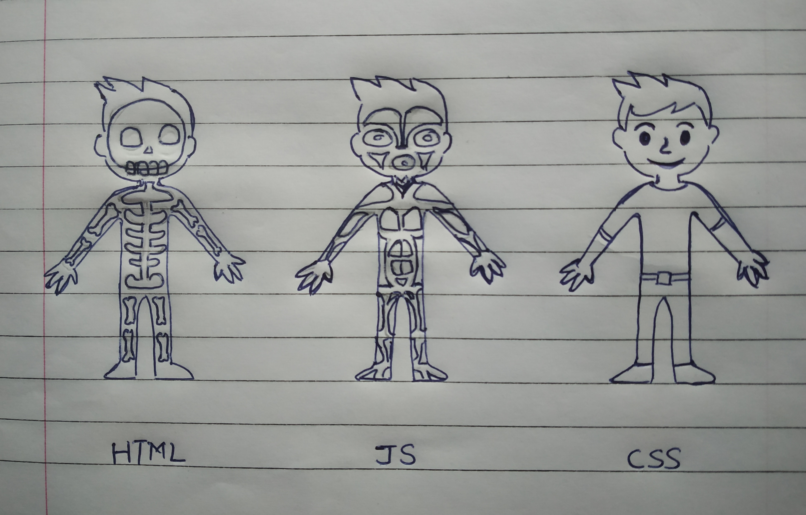

# Introduction to JavaScript

'Java' a word that every programming student has come across. Another similar word that we often hear is 'JavaScript'. Often people make the mistake of assuming them to be the same. And Yes, in some ways they are similar but are fundamentally different.

| Java | JavaScript |
| :--: | :--------: |
| Java is Strongly typed language | JS is weakly typed language |
| Java application runs on JVM(Virtual machine) or browser | JS code can run on browser and on a server via Node.js |
| Object of Java are class based | JS objects are prototype based |
| Has .java as extension | Has .js as extension |
| Standalone language | Integrated with HTML content and contained within webpages |
| Supports multi-threading | Doesn't support Multi-threading |

 

> JavaScript is a scripting language that is single-threaded and  and synchronous. It is used to create and control dynamic website content i.e anything that moves, refreshes or changes (without us requiring to manually reload the web page)

# Why to use JavaScript ?

Now, what makes JS so popular and why should we learn about JS ?

In today's world, web & mobile applications have dominated the tech industry. And when it comes to web applications, the three elements that form the backbone of web applications are :-

* HTML - decides the structure of our page - headers, body , images, etc
* CSS - controls how the page looks - font, background colors, etc
* JavaScript - used to make the site dynamic - interactive forms, auto complete suggestions, etc

Meanwhile, because JavaScript is such an integral part of web functionality, all major web browsers come with built-in engine that can render JavaScript. This means that we can type JS commands into an HTML and web browser will be able to understand them. To put it simply, JS doesn't require downloading any additional programs or compilers.

Additionally, this is not all the advantages that JS provide the developers. We can also use JS for :-
* Developing Mobile applications
* Creating web browser based games
* Back end web development
* Web Servers

As we can see, JS is a very valuable scripting language that web developers must learn.

Since JavaScript is vast to learn, I have divided into multiple sections :-

* Basic 
* Advanced
* Arrays, Objects & Functions
* ES6 

