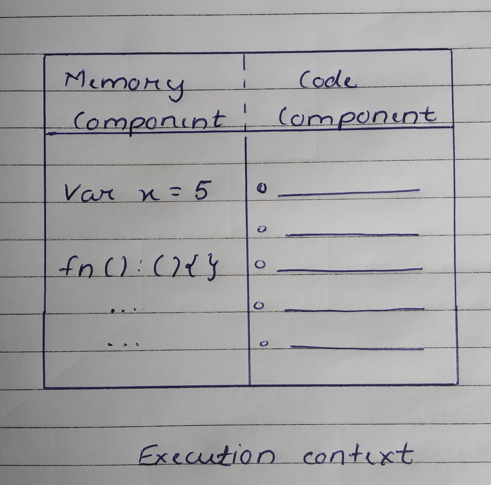
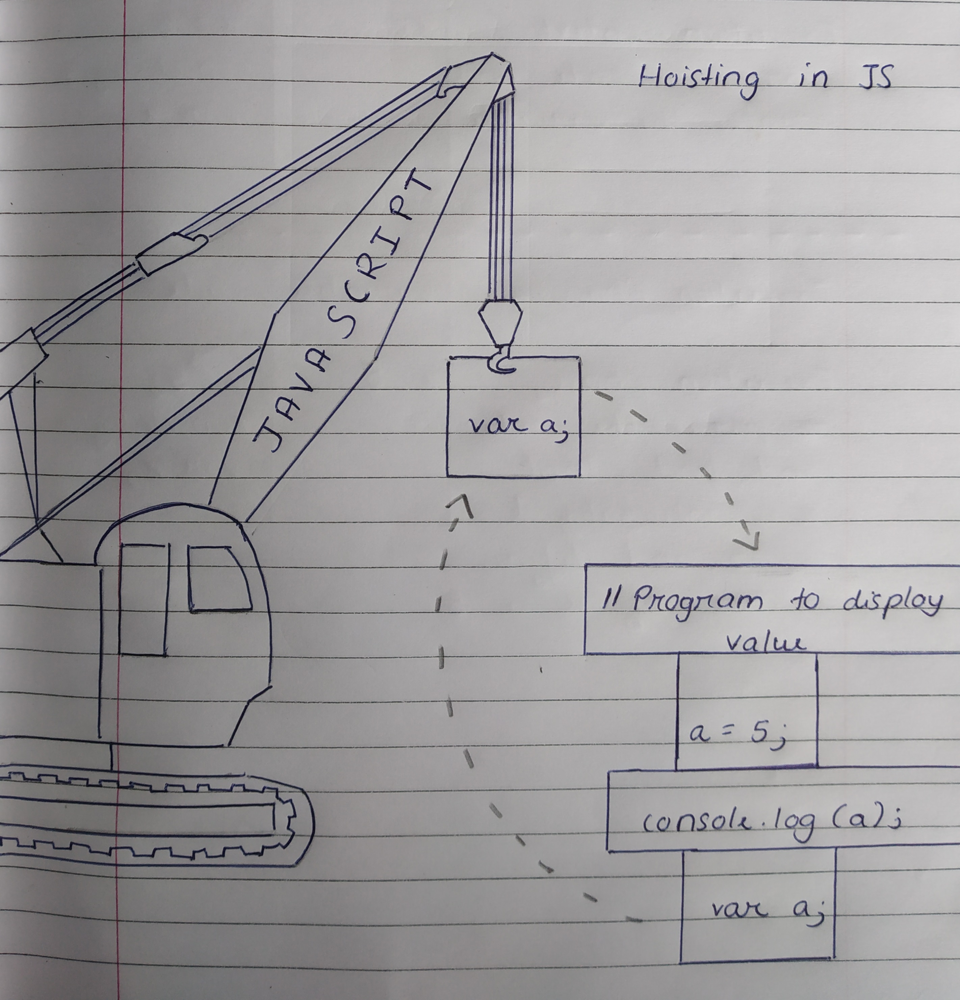
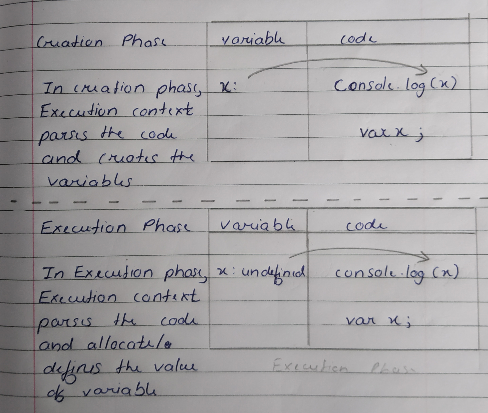
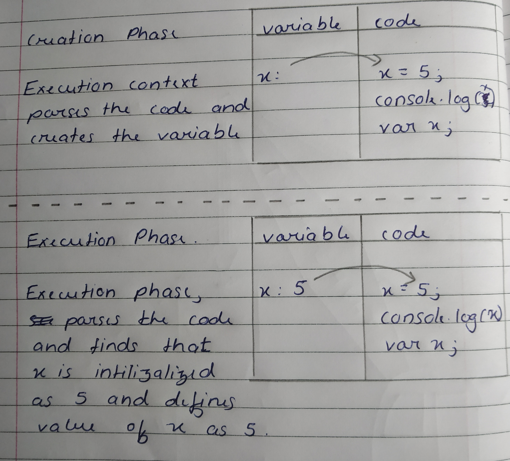
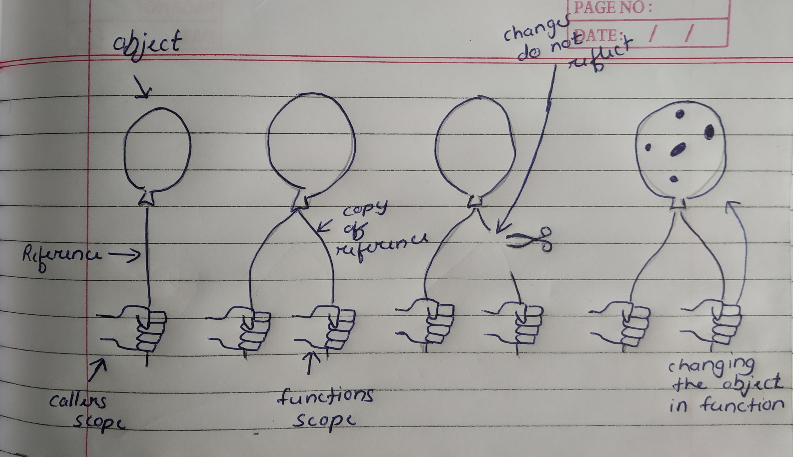
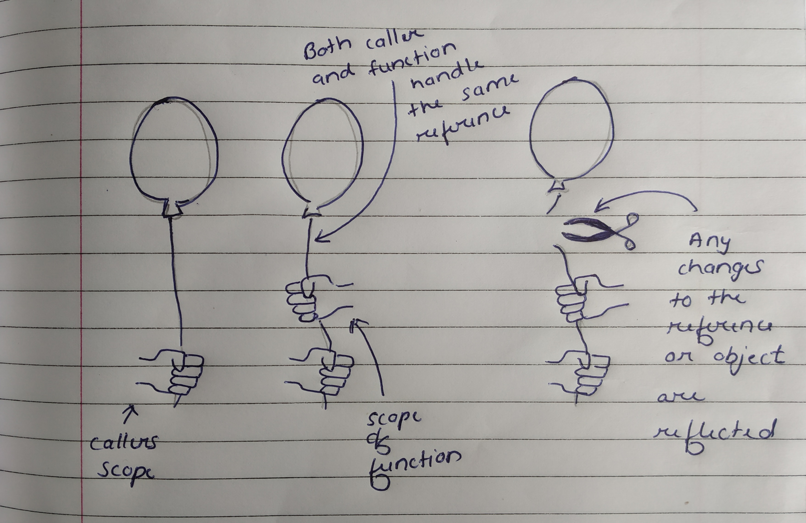
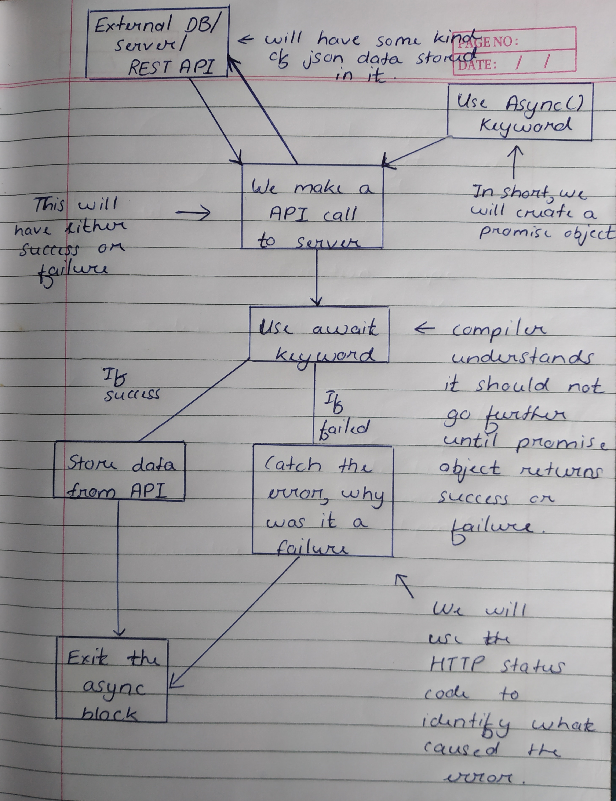

## <span class="header2">Execution Context</span>

Execution Context is something that is often neglected concept. But it is one of the most important thing a JS programmer must know about. What makes Execution Context so important is that it helps us understand how JavaScript code runs. It will also help us understand concepts like Hoisting and Closure better. Everything in JS happens inside an 'Execution Context'.  

Execution Context is divided into two compoenents :-
1. Memory Component
2. Code Component



Memory Component

This is also known as Variable Enviornment. It is here where all the variable and functions are stored in the format of key-value pair.

Code Component

This is also known as Thread of Execution. It is here where code is executed one line at a time. Also, it can only get executed in a specific order. It cannot go to the next line unless previous line is finished executing.

## <span class="header2">Hoisting</span>

Hoisting is nothing but a default behaviour of JavaScript to move variable declaration to the top of the scope. The important thing to remember here is that only declarations will be moved to the top and not initalization.







## <span class="header2">Closure</span>

Closure is a function bundled together with its lexical environment. This basically means that closure gives us access to another function's scope from an inner function.

Eg :-
```js
function outer(){
  let x = 10;
  function inner(){
    let y = 20;
    console.log(x); // 10
  } 
  inner();
  console.log(y);  // UnCaught reference: y is not defined
}
outer();
```

In the example, inner function could access variable x. But outer function could not access the variable y. 

## <span class="header2">Pass by value and Pass by reference</span>

In pass by value, changes made to the arguments in the called function will not be reflected in the calling function. However, it is not the case for Objects. When we pass an object to a function, you are passing the reference of that object. Therefore, the function can modify the properties of the object via its reference.



```js
let a = 1;
  let change = (val) => {
    val = 2;
  }
change(a);
console.log(a); // Output - 1
```

In pass by reference, the changes made to the arguments in the called function will be reflected in the calling function.



```js
let a = {num:1};
  let change = (val) => {
   val.num = 2
  }
change(a);
console.log(a); // Ouput - 2
```

## <span class="header2">Concept of 'this'</span>

In JS, the keyword `this` is going to be used at multiple places which makes it essential that we understand how `this` keyword works. In simple terms, `this` points to a particular object. However, which object it point towards changes depending on how the function which includes `this` keyword is called.

There are four scenarios which can affect how `this` behaves :-
1. Global Scope
2. Object's Method
3. call( ) or apply( )
4. bind( )

### <span class="header3">Global Scope</span>

If a function is called from global scope and it includes `this` keyword then the keyword `this` will point to the window object. Even if the function is a inner function it will still point to the global window object.

```js
var num = 100;

function someFunction(){
  function someFunction2(){
    var num = 200;

    alert('number =' +num);  // 200
    alert('this.number =' +this.num);  // 100
  }
  someFunction2();
}
someFunction();
```

### <span class="header3">Object's Method</span>

If we create an object of a function and use the `this` keyword then the `this` keyword will point to that particular object. This behaviour doesnt change even if we create object using object literal.

```js
var num = 100;

var obj = {
  num : 300;
  someFunction :someFunction2(){
    var num = 200;
    
    alert('number =' +num);  // 200
    alert('this.number =' +this.num);  // 300
  };
}

obj.someFunction();
```

### <span class="header3">call( ) & apply( )</span>

In JS, we can invoke a function using call( ) as well as apply( ) method. We can use these methods which will set `this` keyword to point to the function's object irrespective of where it is being called from.

```js
var num = 100;

function someFunction(){
  alert(this.num)l
}
var obj1 = {num: 200, Function: someFunction };
var obj2 = {num: 300, Function: someFunction };

someFunction(); // 'this' will point to window object
someFunction().call(obj1); // 'this' will point to obj1
someFunction().apply(obj2); // 'this' will point to obj2
```

### <span class="header3">bind( )</span>

Similar to call( ) & apply( ), we can use bind( ) method. bind( ) method is used to set the context of `this` to a specified object when function is invoked.

```js
var num = 100;

function someFunction(callback){
  var num = 200;
  callback();
};

var obj = {
  num : 300,
  Function : function(){
    alert('this points to' + this +, 'num =' +this.num);
  }
};

someFunction(obj.Function); // 'this' will point to window object
someFunction(obj.Function.bind(obj)); // But here 'this' will point to obj
```

## <span class="header2">Promise</span>

In JS, Promise is an Object that returns a value. The best way to understand a Promise is our current scenario. By uptaking the MissingSkill Grind, we can say that I have Promised to complete the report by 26th May. 


As we can see, in the above Promise structure we can see three states :-
* Pending - we dont know if i will complete the report
* Fulfilled - I completed the report
* Rejected - I couldnt complete the report 

A Promise begins with Pending state and it will end with either fulfilled or rejected state.

We can also use `then()` and `catch()` blocks along with returned promise object.


Additionally, we can use `then()` to create promise chains, which will help us execute two or more async operations.


Eg :-
```js
// promise chaining
doSomething()
.then(function(result){
  return doSomethingElse(result)
})
.then(funciton(newResult){
  return doAnotherThing(newResult)
})
.catch(failureCallback);
```

Along with this, there is also the `finally()` block which is used to execute some code once promise is resolved, regardless of its result.


## <span class="header2">Async await</span>

Async await is nothing but syntactical sugar for Promises. JS is a synchronous language and promises make use of asynchronous operations, so here async await helps us in writing synchronous looking code while performing asynchronous tasks.



## <span class="header2">Tech Debt</span>

### <span class="header3">Concat & Addition</span>

JavaScript uses '+' operator for both addition and concatenation. Simply put numbers will be added and Strings will be concatenated. Although we must remember that JS interpreter works from left to right, so the operations will be performed accordingly.

```js
var x = 10;
var y = 10;
var z = "10";

var result = x + y + z; // Result will be 2010  
```
### <span class="header3">NaN</span>

`NaN` is a reserved keyword to indicate that number is not legal number.

Eg :-
```js
var x = 100/"Apple"; // x will be NaN
```

### <span class="header3">Equality Check</span>

Unlike in real life where '=' operator is used to check for equality, JS uses it for other purposes and to make up for the ability of equality '==' and '===' operators were introduced

| = | == | === |
|-- | -- | --- |
| Used to assign values to variable | Used for comparing two variable, but doesnt consider datatype | Used for comparing two variable, but also checks datatype and compares two values |
| Assignment Operator | Comparison Operator | Comparison Operator |
| Does not return true or false | Returns true if two operands are equal | Returns true only if both value and data types are the same for two variables |

### <span class="header3">null</span>

Null means nothing, something that doesn't exist. However in JS, null return type of as an object. This is a confirmed bug by the developers, a bug that unfortunately cannot be reversed at this point of time.

### <span class="header3">Truthy & Falsy</span>

In JS, each value has an inherent boolean value, which is known as truthy or falsy. 

The following values are always falsy :
* false
* 0
* '' or ""
* undefined
* NaN

Everything else is truthy that includes :
* true
* 'a'
* []
* {}
* function(){}

So how to find out if a value is truthy or falsy ? Its simple, we just need to pass it in a if block 

Eg :-
```js
if(value){
  // its truthy
} else{
  // its falsy
}
```

<style>
.highlight{
  color: #75FF33
}
.header3{
  color: #E6D100
}
.header{
  color: #EE82EE
}
.header2{
  color: #00FFFF
}
.imp{
  color: #FF8080
}
</style>