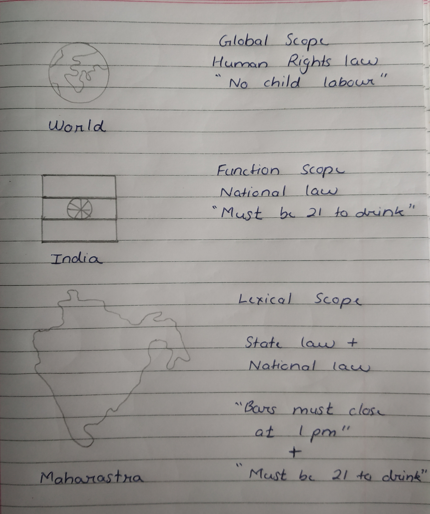

# <span class="header">JavaScript Programming Basics</span>

## <span class="header2">Variables</span>

Often, Variables are said to be empty boxes in which data can be stored. However, its not quite right as data is actually stored in the memory and variable is just a label that point towards the memory location.

Syntax of variables is :
```js
var name;
```

Eg :- Think of Memory locations as boxes that can store information and think of variables as name tags that help us remember which variable has which kind of data sotred in it. 

```js
📦 Memory1 <- 🏷️(Dress) = 👗 
📦 Memory2 <- 🏷️(Yo-Yo) = 🪀
📦 Memory3 <- 🏷️(Hammer) = 🔨 
```
### <span class="header3">DataTypes</span>

JavaScript has different data types to hold different types of values. There are two types of data type in JavaScript.
1. Primitive data type
2. Non-Primitive data type

Since JS is a dynamic type language, we dont need to specify type of the variable because it is dynamically used by JS engine.

Eg :-

```js
var a = 1 ; //holding a number
var b= "Gaurav"; //holding a string
```

Below are types of Primitive and Non-Primitive Data types used in JavaScript :-
<table>
<tr>
<td colspan="2">Primitive Data Type</td>
<td colspan="2">Non-Primitive Data Type</td>
</tr>
<tr>
<td>Data Type</td>
<td>Description</td>
<td>Data Type</td>
<td>Description</td>
</tr>
<tr>
<td>String</td>
<td>represents sequence of characters</td>
<td>Object</td>
<td>represents instance through which we can access members</td>
</tr>
<tr>
<td>Number</td>
<td>represents numeric value</td>
<td>Array</td>
<td>represents group of similar values</td>
</tr>
<tr>
<td>Boolean</td>
<td>represents boolean value ie true or false</td>
<td>RegExp</td>
<td>represents regular expression</td>
</tr>
<tr>
<td>Undefined</td>
<td>represents undefined value</td>
</tr>
<tr>
<td>Null</td>
<td>represents no value at all</td>
</tr>
</table>
<br>

### <span class="header3">Variable scope</span>

Scope refers to the visibility of variables. In other words, which parts of your program can see or use it. We can understand it using laws. 

Global Scope - Just like laws at global level are applicable to all, in same way variables declared in global scope can be accessed in all other scope.

Function Scope - Laws that are applicable at National level may not be applicable at World level. Just like that whenever we declare a variable in a function, the variable is visible only within the function.

Lexicla Scope :- Each State can have their own laws but a State must implement their own set of law while adding the laws at National level. And Just like a State is bound to their National laws, Children functions are bound to their parents Scope. Lexical scope means the children scope have the access to the variables defined in the parent scope.



### <span class="header3">Identifiers</span>

All variables in Javascript must be identified with a unique name. These unique names are called identifiers.

The general rules for constructing identifiers name are :-
* Names must contain letters, digits, underscores, dollar sign
* Names must begin with a letter
* Names can also begin with $ and _
* Names are case sensitive
* Reserved words cannot be used as names

Eg :-
```js
var x = 4; or var sum = 4;//Identifiers can be short names (x and y) or can be detailed (age, sum, total)

var x = 4; and var X = 4; //x and X are considered to be different vairables due to case sensitivity
```

### <span class="header3">Reserved words</span>

JavaScript has certain words that must not be used as variables. These words are known as Reserved words.

|          |           |         |       |       |      |      |       |
| -------- | --------- | ------- | ----- | ----- | ---- | ---- | ----- |
| abstract | arguments | await | boolean | break | byte | case | catch | 
| char | class | const | continue | debugger | default | delete | do |
| double | else | enum | eval | export | extends | false | final |
| finally | float | for | function | goto | if | implements | import |
| in | instanceof | int | interface | let | long | native | new | 
| null | package | private | protected | public | return | short | static |
| super | switch | synchronized | this | throw | throws | transient | true | 
| try | typeof | var | void | volatile | while | with | yield | 
<br>

## <span class="header2">Operators</span>

An Operator performs some operation on single or multiple operand(some data) and produces a result. Javascript has two types of operator :-
1. Unary - operates on one operand. Eg :- x++
2. Binary - operates on multiple operand. Eg :- x + y
   
### <span class="header3">Arithemetic Operator</span>  

| Operator | Description |
| -------- | ----------- |
| + | Addition |
| - | Subtraction |
| * | Multiplication |
| ** | Exponentiation |
| / | Division |
| % | Modulus |
| ++ | Increment |
| -- | Decrement |
<br>

### <span class="header3">Assignment Operator</span>

For below expample consider :- `var x = 5, y = 10, z = 15;` 

| Operator | Description | Example |
| -------- | ----------- | ------- |
| = | Assigns right operand value to left operand | <code> x = y;  // x will be 10 </code>|
| += | Sums up left and right operand values and assign the result to left operand | <code> x += 1; // x will be 6 </code> |
| -= | Subtract right operand value from left operand value and assign the result to left operand | <code>x -= 1; // x will be 4</code>|
| *= | Multiply left and right operand values and assign the result to the left operand | <code>x *= 5; // x will be 25</code>|
| /= | Divide left operand value by right operand value and assign the result to the left operand | <code>x /= 5; // x will be 1</code>|
| %= | Get the modulus of left operand divide by right operand and assign result modulus to left operand | <code>x %= 2; // x will be 1</code>|
<br>

### <span class="header3">Comparison Operator</span>

| Operator | Description |
| -------- | ----------- |
| == | equal to |
| === | equal value and equal type |
| != | not equal |
| !== | not equal value or not equal type |
| > | greater than |
| >= | greater than or equal to |
| <= | less than or equal to |
| ? | ternary operator |

### <span class="header3">Logical Operator</span>

| Operator | Description | 
| -------- | ----------- |
| && | logical and |
| \|\| | logical or |
| ! | logical not |

### <span class="header3">Bitwise Operator</span>

| Operator | Description | Example | Same as | Result | Decimal |
| -------- | ----------- | ------- | ------- | ------ | ------- |
| & | AND | 5 & 1 | 0101 & 0001 | 0001 | 1 |
| \| | OR | 5 \| 1 | 0101 | 0001 | 0101 | 5 |
| ~ | NOT | ~5 | ~0101 | 1010 | 10 |
| ^ | XOR | 5 ^ 1 | 0101 ^ 0001 | 0100 | 4 |
| << | Zero fill left shift | 5 << 1 | 0101 << 1 | 1010 | 10 |
| >> | Signed right shift | 5 >> 1 | 0101 >> 1 | 0010 | 2 |
| >>> | Zero fill right shift | 5 >>> 1 | 0101 >>> 1 | 0010 | 2 |


### <span class="header3">Type Operator</span>

| Operator | Description |
| -------- | ----------- |
| typeof | Returns the type of a variable |
| instanceof | Returns true if an obkect is an instance of an object type |

### <span class="header3">Ternary Operator</span>

JavaScript includes special operator called ternary operator : ? that assigns a value to a variable based on some condition.

Synatx :-
```
<condition> ? <value1> : <value2>;
```

## <span class="header2">Conditional Statement</span>

Conditional statements are used to perform different actions based on different conditions. 

### <span class="header3">if</span>

Use the `if` statement to specify a block of JavaScript code to be executed if a condition is true.

Syntax :-
```js
if(condition){
  // block of code to be executed if the condition is true.
}
```

### <span class="header3">else</span>

Use the `else` statement to specify a block of code to be executed if the condition is false.

Syntax :-
```js
if(condition){
  // block of code to be executed if the condition is true.
} else {
  // block of code to be executed if the condition is false.
}
```

### <span class="header3">else-if</span>

Use the `else-if` statement to specify a new condition if the first condition is false.

Synatx :-
```js
if(condition){
  // block of code to be executed if condition 1 is true.
} else if(condition){
  // block of code to be executed if condition 1 is false and condition 2 is true.
} else {
  // block of code to be executed if the condition 1 is false and condition 2 is false.
}
```

## <span class="header2">Switch-Case</span>

Use the `switch` statement to select one of many code blocks to be executed.

Synatx :-
```js
switch(expression){
case 1 :
  // some code
  break;
case 2 :
  // some code
  break;
default:
  // code block  
}
```

## <span class="header2">Loop Control</span>

### <span class="header3">break</span>

When JS reaches a `break` keyword, it breaks out of the switch block. This will stop the execution inside the switch block. If we dont write the break statement, the next case will be executed even if evaluation does not match.

### <span class="header3">default</span>

The `default` keyword specifies the code to run if there is no case match. Most of the times we write default case at the end of switch block, but it does not have to be the last case. We can write it anywhere other than at the end too although we must remember to include break statement.

### <span class="header3">Continue</span>

The `continue` statement breaks one iteration, if a specified condition occur, and continues with the next iteration in the loop.

### <span class="header3">Labels</span>

With a `label` reference, the break or continue statement can be used to jump out of any code block. It is used to prefix a label to an identifier.

## <span class="header2">While loop</span>

These are loops that can execute a block of code as long as a specified condition is true.

### <span class="header3">While Loop</span>

The `while` loop will loop through a block of code as long as specified condition is true.

Syntax :-
```js
while(condition){
  // code block to be executed
}
```
### <span class="header3">Do-while</span>

The `do-while` loop is just a variant of while loop. This loop will execute code block once, before checking if the condition is true, then it will repeat the loop as long as the condition is true.

Syntax :-
```js
do {
  // code block to be executed
}
while(condition);
```

## <span class="header2">For Loop</span>

For loops are handy, if we want to run the same code over and over again

### <span class="header3">For</span>

The `for` loop will loop through a block of code a number of times.

Syntax :-
```js
for(initialization, condition, incrementation/decrementation){
  // code block
}
```

### <span class="header3">For-In</span>

The `for-In` statement will loop through the properties of an Object/Array

Syntax for Object :-
```js
for(key in object){
  // Code block
}
```

Syntax for Array :-
```js
for(variable in array){
  // Code block
}
```

### <span class="header3">For-Each</span>

The `forEach()` method calls a function once for each array element. This is also known as Enhanced For loop.

Syntax :-
```js
for(type var: array){
  statement using var;
}
```

### <span class="header3">For-Of</span>

`for-of` will loop through the values of an iterable object.

Syntax :-
```js
for (variable of iterable) {
 // code block to be executed
}
```

<!-->
<style>
.highlight{
  color: #75FF33
}
.header3{
  color: #E6D100
}
.header{
  color: #EE82EE
}
.header2{
  color: #00FFFF
}
.imp{
  color: #FF8080
}
</style>