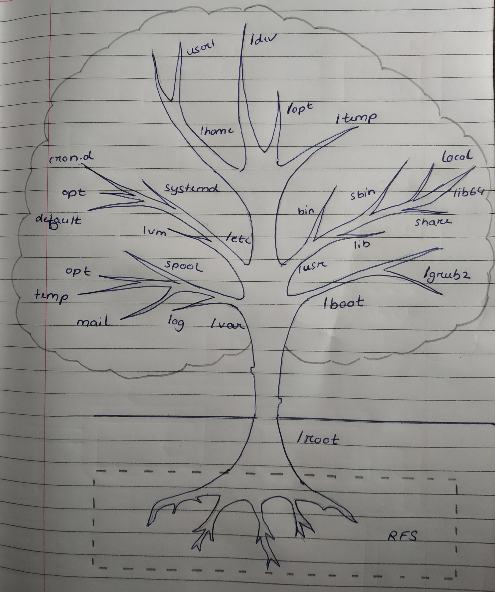

# Introduction to Linux

Just like Windows, Mac or IOS, Linux an Operating System. But What is an operating System ? What does it do ? And the answer is that, 
>An Operating System (OS) is a bridge between the software and hardware  component of the the device. 

It manages all of the hardware resources associated with our desktop or laptop. Without an OS the device wouldn't function.

## Why use Linux ?

Until a few years ago, Linux was used mainly for servers and was not considered suitable for desktops. But it's user-interface and ease of use has been steadily improving over the past few years. And Now, there are many reasons why Linux should be preferred over other software such as Windows or Mac. Given below are few of the reasons why.

* Simplified Update for all Software
  
  Maintaining the Linux OS is easy, as the user can centrally update the OS and all software installed very easily. All the variants of Linux have their own central software repository, which is used to update the system and keep it safe. They offer regular updates and the system can be updated without rebooting it. Updating a Windows system is not so easy compared to a Linux system . Also, in Windows, all the third party software like Acrobat Reader and Firefox have to be updated individually.

  With Linux any app can be installed using a single command such as :

  <pre>
  <b>$ sudo yum install package</b> 
  or 
  <b>$ sudo apt install package</b>
  </pre>

  Also, any app can be upgraded using command such as :

  <pre>
  <b>$ sudo yum update</b> 
  or 
  <b>$ sudo apt update</b> // This will update the repository 
  <b>$ sudo apt upgrade</b>  // This will update the app.
  </pre>

  To uninstall the app the command is as follows :

  <pre>
  <b>$ sudo yum remove package</b> 
  or 
  <b>$ sudo apt remove package</b>
  </pre>

* Free Software Licensing

  Linux is completely free and users do not need to pay for anything . All the basic software required by a user and even an advanced user are available. Even the equivalent of professional software for desktop publishing, photo editing, audio editing and video editing are available.

  This feature is especially useful for commercial organizations such as Schools, Businesses and I.T Companies. Compare it to Windows OS whose Basic version can costs up to Rs 9,299.00 and Pro version can cost up to Rs 22,799.00 for a single PC. Imagine, a Company (assuming to have at least 10 employees) must spend a minimum of Rs 9,29,900.00 to get started.

* Access to Open Source

  "Source code" is the part of software that most computer users don't ever see; it's the code computer programmers can manipulate to change how a piece of software—a "program" or "application"—works. Programmers who have access to a computer program's source code can improve that program by adding features to it or fixing parts that don't always work correctly.
 
  This comes as shock to many people that 'Android' one of the most popular mobile operating system is based on Linux . But do not misunderstand what that line means. To put it simply, Android may be based on Linux, but it's not based on the type of Linux system that we use on PC i.e We cannot run Android apps on Linux and vice-versa. 

  So, What does it mean when we say 'Android is based on Linux'? Here, when we use the word 'Linux' we mean the 'Linux kernel' <a href="#kernel">(What is Kernel ?)</a>

* Multiple Distribution  

  Operating system like Microsoft combine each bit of codes internally and release it as a single package.

  But linux is different. Different parts (this includes kernel, shell utilities, X server, system environment, graphical programs,etc) of Linux are developed by different organizations. Thats where distribution (also called as distros) are needed. They assemble all the parts and give us compiled operating system of Linux to install and use.

  Today, on average six hundred Linux distributors provide different features. Some of the popular ones are :

  | Distribution | Why to use |
  | :----------  | :--------- |
  | UBuntu | It works like Mac OS and easy to use |
  | Linux | It works like windows and should be use by new comers |
  | Debian | It provides stability but not recommended to a new user |
  | Fedora | If you want to use red hat and latest software |
  | Red hat enterprise | To be used commercially |
  | CentOS | If you want to use red hat but without its trademark |
  | OpenSUSE | It works same as Fedora but slightly older and more stable |
  | Arch Linux | It is not for beginners because every package has to be installed by oneself |

* Malware Protection
  
  It is believed that Linux is more secure than Windows because of the way it handles user permissions. As running an ".exe" file is much harder since Linux does not process executables without explicit permission (In simple terms we need to chmod +x a file before we can run it). This makes Linux much safer as most of the malware and virus come in the form of an ".exe".

  Another advantage that Linux has is that viruses can be  more easily removed. In Linux, system-related files are owned by "root" superuser. If infected, viruses can be removed as they can affect the user account and not the root account.

  Ofcourse in the end, it is a fact that no operating system is completely secure and free from vulnerabilities, but yes, its much harder to infect an Linux system compared to Windows .

  Although, recently it was discovered that hackers are now using advanced malware to target Linux servers, this malware is known as "RedXOR". RedXOR is basically a backdoor targeting system that has capabilities like exfiltrating data to tunneling network traffic to another destination. Malware's like this could be a concern for the future of Linux security.

# What is kernel ?

A Kernel is a computer program that is the heart and core of an Operating system . Since the Operating system has control over the system so, the kernel also has control over everything in the system. Kernel is the first program that is loaded after the bootloader, it remains into memory until operating system is shutdown.

Functions of Kernel :-
* Access Computer resource - It can access various resources like CPU, I/O devices, etc.
* Resource Management - It shares the resources between different process in such a way that there is uniform access to the resource by every process.
* Memory Management - Every process needs memory space. All the memory management like allocation and de-allocation for execution of process is done by kernel.
* Device Management - Kernel also manages the peripheral devices connected in the system.

# Basic Linux Commands

The Linux command line is a text interface to our computer. It is often referred to as shell, terminal, console, or other various names. It is in this terminal that we will run our commands. Now, let us look at some basic yet important commands in Linux :-

| Commands | Fullforms                       | Their Function                                                                    |
| :------- | :------------------------------ | :-------------------------------------------------------------------------------- |
| cd       | Change Directory                | To navigate through Linux files and directories                                   |
| ls       | List                            | To view the contents of a directory                                               |
| cat      | Concatenate                     | To list the contents of a file on the standard output (sdout)                     |
| cp       | Copy                            | To copy files from the current directory to a different directory                 |
| mv       | Move                            | To move files, although it can also be used to rename files                       |
| rm       | Remove                          | To delete directories and the contents within them                                |
| pwd      | Print Work Directory            | To find out the path of the current working directory(folder)                     |
| mkdir    | Make Directory                  | To make a new directory                                                           |
| rmdir    | Remove Directory                | To delete a directory                                                             |
| touch    | -                               | To create a blank new file                                                        |
| locate   | -                               | To locate a file                                                                  |
| find     | -                               | To locate a file within a given directory                                         |
| grep     | Global Regular Expression Print | To let us search through all the text in a given file                             |
| sudo     | SuperUser Do                    | Enables us to perform tasks that require administrative or root permissions       |
| df       | Disk Free                       | Shows a report on the System's disk space usage                                   |
| du       | Disk Usage                      | To check how much space a file or directory takes                                 |
| head     | -                               | To view the first ten lines of a text file                                        |
| tail     | -                               | To view the last ten lines of a text file                                         |
| diff     | Difference                      | Compares the contents of two files line by line                                   |
| tar      | Tape Archive                    | To archive multiple files into a tarball(Linux file format similar to zip format) |
| chmod    | Change Mode                     | To change the read, write and execute permissions of files and directories        |
| chown    | Change Owner                    | To change or transfer the ownership of a file to specified username               |
| jobs     | -                               | To display all current jobs along with their statuses                             |
| kill     | -                               | To terminate unresponsive programs                                                |
| ping     | -                               | To check connectivity status to a server                                          |
| wget     | _                               | Used to download files from the internet                                          |
| uname    | Unix Name                       | To print detailed information about our Linux system                              |
| top      | Table of Processes             | To display a list of running processes and how much CPU each process uses         |
| history  | -                               | To review the commands you've entered before                                      |
| man      | Manual                          | To display the user manual of any command that we can run on the terminal         |
| echo     | -                               | To display line of text/string that are passed as an argument                                                      |
| zip      | -                               | To compress files into a zip archive                                              |
| unzip    | -                               | To extract the zipped files from a zip archive                                    |
| hostname | -                               | To know the name of host/network                                                  |
| useradd  | -                               | To create a new user for Linux system                                             |
| userdel  | -                               | TO delete a user from Linux system                                                |

## Linux Commands With Flags

Linux Commands can also be used with certain options, also often referred to as flags or a switch, which are either single-letter or a full word. The function of these flags are to modify the behavior of the commands in such a way that will helps us navigate, manipulate or edit things quicker.

Below are some commands with their flags :

<table>
<tr>
<td>Command</td>
<td>flags</td>
<td>functions</td>
</tr>
<tr>
<td rowspan="4">cd</td>
<td>cd ..</td>
<td>To move one directory up</td>
</tr>
<tr>
<td>cd or cd ~</td>
<td>To go straight to home folder</td>
</tr>
<tr>
<td>cd -</td>
<td>To move to previous directory</td>
</tr>
<tr>
<td>cd /</td>
<td>To move to root directory</td>
</tr>
<tr>
<td rowspan="3">ls</td>
<td>ls - R</td>
<td>To list all the files in the sub-directories</td>
</tr>
<tr>
<td>ls - a</td>
<td>To show the hidden files</td>
</tr>
<tr>
<td>ls - al</td>
<td>To list the files and directories with detailed information like permissions, size, owner, etc.</td>
</tr>
<tr>
<td rowspan="3">mkdir</td>
<td>mkdir - p</td>
<td>To create sub-directories of a directory(with missing parent directories, if any)</td>
</tr>
<tr>
<td>mkdir { }</td>
<td>will create multiple directories in current location</td>
</tr>
<tr>
<td>mkdir -m777</td>
<td>Creates a directory and sets read, write, execute permissions for all users</td>
</tr>
<tr>
<td rowspan="2">cat</td>
<td>cat > &lt;filename&gt;</td>
<td>writes into the file and overwrites the file
which already existed</td>
</tr>
<tr>
<td>cat >> &lt;filename&gt;</td>
<td>To update the existing file</td>
<tr>
<td rowspan="3">rm</td>
<td>rm - i</td>
<td> will prompt before removing the file</td>
</tr>
<tr>
<td>rm - r</td>
<td>will remove the directories and their content recursively</td>
</tr>
<tr>
<td>rm *</td>
<td>removes all files from the current directory</td>
</tr>
<tr>
<td>head or tail</td>
<td>head -n or tail -n</td>
<td>will show 'n' number of lines from the file</td>
</tr>
<tr>
<td rowspan="2">kill</td>
<td>SIGTERM</td>
<td>Using this will request a program to stop running. It will also make time to save the progress</td>
</tr>
<tr>
<td>SIGKILL</td>
<td>This will force stop the program but any unsaved progress will be lost</td>
</tr>
</table>
 

# Linux File System

Linux uses a hierarchical file system structure, like a tree with root(/) at the base of the file system and all other directories spreading from there. A Linux file system is a collection of files and directories and each directory has a specific purpose(i.e they generally hold same types of information for easily locating files).

| Directory | Description |
| --------- | ----------- |
| /boot | System kernel is stored |
| /bin | binary files are stored |
| /sbin | System binary is stored and it is used by the Sys admin |
| /home | User data is stored |
| /var | Variable file  |
| /usr | User system resource  |
| /root | Home directory for the root user |
| /(root filesystem) | Top level directory of the filesystem. Contains files required to boot the system. Also contains files like executables and libraries required to boot remaining filesystem |
| /tmp | Temporary directory. Used by OS and other apps to store temporary files |
| /etc | Contains System Configuration files |
| /lib | System Libraries are stored  |
| /mnt | Temporary Mount point for RFS (Used when admin is repairing or working on System File) |
| /dev | Contains the device files for every hardware device attached to the system |
 

