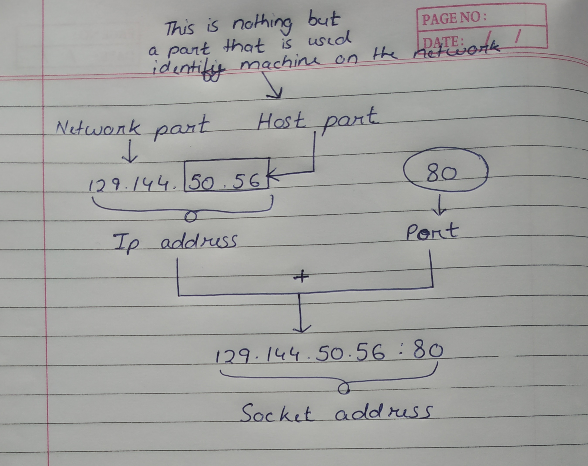

# Basic Building Blocks of Web Application Development

* Software Languages
* IP address
* Domain & Web Hosting
* HTTP / HTTPS
* Database
* Licenses

# IP Address

IP stands for 'Internet Protocol', which means a set of rules for the format of data sent via Internet or local network.
>An IP address is a unique address made up of string of numbers that identifies a device on the internet or local network.

These string of numbers are not random. They are mathematically produced and allocated by (IANA) Internet Assigned Numbers Authority, its a division of (ICANN) Internet Corporation for Assigned Names and Numbers.

## Types of IP 

There are two types of IP address :-

1. Public IP address. Public address can be futher subdived into 2 categories :-
   1. Static IP address
   2. Dynamic IP address
2. Private IP address 
   
## Versions of IP address

Currently, there are two versions of IP that coexist in the global internet. 
1. IP version 4 (IPv4)
2. IP version 6 (IPv6) 

IP address are made up of binary values. IPv4 address are 32 bits long, and IPv6 address are 128 bits long.

## IPv4

| Class | Range | Used For |
| ------- | ----- | --- |
| Class A | 0 - 127 | Local system |
| Class B | 128 - 191 | Internet |
| Class C | 192 - 223 |  Local Network |
| Class D | 224 - 239 |  Not used/Reserved |
| Class E | 240 - 255 |  Not used |

## IPv6

IPv6 is the next generation Internet Protocol standard intended to eventually replace IPv4. Since at the start, it was thought that IPv4 that can support upto 4.3 billion devices would suffice however due to the growth of internet, personal computers and Smartphones this asumation was proved wrong. Which is why IPv6 are developed which can support upto 340 trillion trillion devices. Additionally, IPv6 can handle packets more efficiently, improve preformance and increase security.

## IP address Structure

As we know IPv4 address is written in decimal digits, formatted as four 8-bit fields that are separated by '.'(period). Each 8-bit field represents a byte of the IPv4 address.

The bytes of IPv4 address are futher classified into two parts :
* The network part
* The Host

Additional a port number can be attached to it, which altogether forms a socket address. It is only using these socket address that two device communicate with each other.

To explain with an example, Think of ip address as a real life address in which the network part represents the street name and the host part represents the building name. The port number here represents the apartment number.
 

## Port Range Group

**0 to 1023** - Only special companies like Apple QuickTime, MSN, SQL services, Gopher services and other porminent services have these port numbers.

**1024 to 49151** - Registered ports, means they can be registered to specific protocol by software corporations.(Application port)

**49152 to 65536** - Dynamic or private ports, means that they can be used by anyone.(Open port)

# Domain & Web Hosting

So by now, we know that internet is a gaint network of computer connected to each other and in order for commuincation to occur between them IP address are used. IP address however are long strings of numbers, which can be quite difficult to remember, especially when multiple websites are involved. This is why Domain names were invented to solve this problem. So instead of typing long string of numbers we just need to type the domain name associated to the IP address in our address bar. 

For eg :- `www.google.com` is the domain name whereas its IP address is 8.8.8.8

## How Domain Name Works

When we enter a domain name like google in our browser, it first sends request to the DNS (Domain Name System) which is global network of servers. These servers then look up for the name servers associated with domain and forward the request to those name servers.
 
For eg : If we host website on vulter, then its name server info will be :-

`ns1.vulter.com`

`ns2.vulter.com`

Theses name servers are computers managed by the hosting company. The hosting company then forwards our request to the computer where our website is stored.
This computer is called a web server. It has special software like Apache or Nginx installed in it. (Apache and Nginx are web server software which we will talk about later). The web server now fetches the web pages and info associated with it.

## Difference Between Domain, Website and Web Hosting 

So often, I used to get confused between the concept of Domains, Website and Web Hosting. To clarify, Website is made up of files like HTML pages, images and more. If domain name is the web address of our website, then web hosting is the home where our website lives. This is the actual computer where our website files are stored. Such computers are called servers and they are offered as a service by hosting companies.

> To create a website, we need both domain name and web hosting.

# HTTP & HTTPS

HTTP stands for Hyper Text Transfer Protocol. HTTP was invented along side HTML to create the first interactive, text-based web browser. It is a protocol which allows us a way to interact with web resources such as HTML files. HTTP generally uses Transmission Control Protocol (TCP) connection to communicate with servers.

HTTP utilizes specific request methods in order to perform various tasks. These request methods are also known as HTTP verbs. Some of the HTTP verbs are :- 
1. Get - Fetch data from the server
2. Post - Submit data to the server
3. Put - Update data on the server
4. Delete - Delete data from the server

Along with these verbs HTTP also uses  headers that can pass additional information between client and servers. Context-Wise there are three kinds of headers. They are :-
1. General Header - Information not related to the client, server or HTTP.
2. Request Header - Prefered document formats and server parameter.
3. Response Header - Information about the server sending the response.

Now, Whenever clients make a request to the server, the server responds along with a HTTP status code. This code can help us to identify if our request was successful or not. There are five categories of status code, which goes like :-
1.  100-100 - Informational responses
2.  200-299 - Success repsonses
3.  300-399 - Redirect responses
4.  400-499 - Client error responses
5.  500-599 - Server error responses

# HTTP & HTTPS

